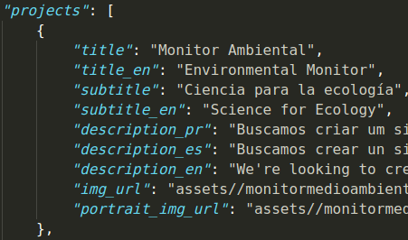
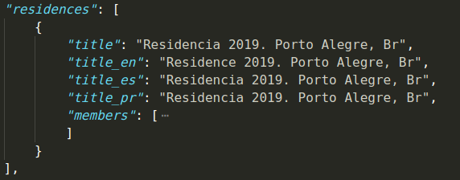
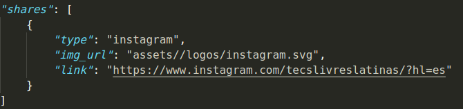

# ReGOSH Landing (0.9.0)

**[Castellano]**

Este repositorio contiene el codigo fuente del landing page de la residencia GOSH.

## TO DO: Completar datos
Luego de haber finalizado con el diseno e interacciones, se requiere un paso mas que es completar con los datos correspondientes a la primera residencia (Proyectos, Informacion de contacto de las personas que participaron en la primera residencia) y con la definicion de la misma (Explicar que es GOSH). Para lograr esto prepare una documentacion a manera de explicar como actualizar esta informacion.

## Documentacion

El codigo del landing se diseno de tal manera que sea *parametrico*, toda la informacion del landing es centralizado por un archivo JSON (data.json), es decir que al editar este archivo con nueva informacion, la pagina leera esta nueva version y mostrara la info actualizada.

Para editar el archivo JSON podemos usar cualquier editor de codigo ([Sublime Text](https://www.sublimetext.com/), [Atom](https://atom.io/), [Visual Studio Code](https://code.visualstudio.com/). Tambien podemos usar este editor online de [JSON](https://jsonformatter.org/json-editor).

La estructura de los datos en data.json es la siguiente:

Se organizo por secciones:
- La seccion *landing* contiene textos y titulos estaticos de la pagina.
- La seccion *projects* contiene la lista de proyectos realizados.
- La seccion *residences* contiene la relacion de participantes por residencia
- *shares* contiene los enlaces en las resdes sociales que tiene reGosh y tecnologias libres.

### Landing
        TO DO
        
### Proyectos
Dentro del campo de proyectos que es un *[array](https://www.w3schools.com/js/js_json_arrays.asp)* o lista de proyectos (dentro del `{}`) se define con la siguiente estructura

Cada proyecto contempla los siguientes datos `title`, `subtitle`, `description`, `img_url` y `portrait_img_url`. `img_url` es el link de una imagen representativa pequena cuadrada del proyecto. `portrait_img_url` se refiere a una imagen de portada (por defecto larga y rectangular) del proyecto y es la que se muestra cuando se expande los detalles del proyectos en el landing.

#### Internacionalizacion
Algunos campos de textos, tipicamente los de *title*, o *description* tienen el detalle de presentarse en multiples idiomas (por ahora esta soportado Espanol, Portugues e Ingles). Para esto, solo se agrega un campo adicional con el mismo nombre del campo y con el sufijo `_en`, `_es` o `_pr` para definir el texto en ese idioma. De igual manera esto aplica para los otros campos

### Residencias
El campo de residencias tiene la siguiente estructura

Dentro del campo "members" es donde se define la informacion de cada miembro, pongo como ejemplo la siguiente estructura de informacion que se podria seguir. En caso no tener o no compartir alguna informacion se puede omitir para el caso de `contact_list` (dejar vacio el array: `[]`), los demas campos son obligatorios.

### Shares
        TO DO
    

## License

This project is licensed under the MIT License - see the [LICENSE.md](LICENSE.md) file for details

---

# ReGOSH Landing (0.9.0)

**[Português]**

Este repositório contém o código-fonte da página Landing da residência GOSH.

## PARA FAZER: Completar dados
Depois de finalizado o design e as interações, é necessário mais uma etapa: completar os dados correspondentes à primeira residência (Projetos, informações de contato das pessoas que participaram da primeira residência) e com a definição dela (Explique o que é GOSH). Para conseguir isso, preparei uma documentação para explicar como atualizar essas informações.

## Documentação
O código da landing é projetado de forma que seja *paramétrico*, todas as informações de aterrissagem são centralizadas por um arquivo JSON (data.json), ou seja, ao editar esse arquivo com novas informações, a página lê esta nova versão e Ele mostrará as informações atualizadas.

Para editar o arquivo JSON, podemos usar qualquer editor de código ([Sublime Text](https://www.sublimetext.com/), [Atom](https://atom.io/), [Visual Studio Code](https : //code.visualstudio.com/) Também podemos usar este editor on-line do [JSON](https://jsonformatter.org/json-editor).

A estrutura dos dados em data.json é a seguinte:

Foi organizado por seções:
- A seção *landing* contém textos e títulos estáticos da página.
- A seção *projetos* contém a lista de projetos concluídos.
- A seção *residências* contém a lista de participantes por residência
- *shares* contém os links nas redes sociais que possuem reGosh e tecnologias livres.
 

### Landing
        PARA FAZER
        
### Projetos
Dentro do campo de projetos que é um *[array](https://www.w3schools.com/js/js_json_arrays.asp)* ou uma lista de projetos (dentro de `{}`) é definida com a seguinte estrutura

Cada projeto contempla os seguintes dados `title`,` subtitle`, `description`,` img_url` e `portrait_img_url`. `img_url` é o link de uma pequena imagem quadrada representativa do projeto. `portrait_img_url` refere-se a uma imagem da landing (por padrão longa e retangular) do projeto e é a mostrada ao expandir os detalhes dos projetos na landing.

#### Internacionalização

Alguns campos de texto, tipicamente os de *title* ou *descrição*, têm o detalhe de serem apresentados em vários idiomas (atualmente, há suporte para espanhol, português e inglês). Para isso, apenas um campo adicional é adicionado com o mesmo nome de campo e com o sufixo `_en`,` _es` ou `_pr` para definir o texto nesse idioma. Da mesma maneira que isso se aplica aos outros campos.

### Residências
O campo residências possui a seguinte estrutura

Dentro do campo "membros" é onde as informações de cada membro são definidas, ponho como exemplo a seguinte estrutura de informações que pode ser seguida. No caso de não ter ou não compartilhar qualquer informação, ela pode ser omitida no caso de `contact_list` (deixe a matriz vazia:` [] `), os outros campos são obrigatórios.

### Compartilhar
        PARA FAZER
    

## Licença

Este projeto está licenciado sob a licença MIT - consulte o arquivo [LICENSE.md](LICENSE.md) para obter detalhes

## Util Commands

To push only dist directory into another branch (gh-pages), commit the changes in dist directory after built, then execute the following command line:

        git subtree push --prefix dist origin-github gh-pages